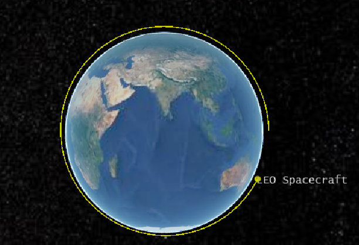

# nyx-czml

Export [nyx-space](https://github.com/nyx-space/nyx) trajectories to [CZML](https://github.com/CesiumGS/czml-writer/wiki/CZML-Guide) for 3D orbit animation in [CesiumJS](https://cesium.com) and [Cesium ion](https://ion.cesium.com).

Positions are emitted as `cartesianVelocity` with HERMITE interpolation, so Cesium reconstructs smooth trajectories from sparse propagator knots without visible segmentation. Optional packets add an orbital trail, text label, ground track, and nadir-pointing sensor footprint.



## Installation

```toml
[dependencies]
nyx-czml = "0.1"
```

## Quick start

```rust
use std::sync::Arc;
use nyx_space::cosmic::MetaAlmanac;
use nyx_czml::{CzmlExportCfg, ToCzml};

// ... propagate your trajectory with nyx ...

let almanac = Arc::new(MetaAlmanac::latest()?);
let cfg = CzmlExportCfg::new("My Spacecraft");
let doc = traj.to_czml(&cfg, almanac)?;
std::fs::write("orbit.czml", doc.to_json()?)?;
```

## Example

A 400 km sun-synchronous orbit propagated for 3 hours. ANISE planetary data (~60 MB) is downloaded automatically on first run and cached in your OS data directory.

```
cargo run --example leo_orbit
```

Writes `leo.czml` — orbit trail, label, ground track, and a 30° sensor footprint. 60× playback (3-hour sim plays in ~3 minutes).

```rust
let almanac = Arc::new(MetaAlmanac::latest()?);
let earth = almanac.frame_info(EARTH_J2000)?;

let orbit = Orbit::try_keplerian(6778.0, 0.001, 98.2, 0.0, 0.0, 0.0, epoch, earth)?;

let cfg = CzmlExportCfg::new("LEO Spacecraft")
    .with_step(60.0 * Unit::Second)
    .with_trail_time(5400.0)
    .with_ground_track()
    .with_sensor(SensorConfig { half_angle_deg: 30.0, color: [0, 100, 255, 80] });
```

## Configuration reference

`CzmlExportCfg` uses a builder pattern. All methods return `Self` and can be chained.

```rust
let cfg = CzmlExportCfg::new("Spacecraft Name")
    .with_step(60.0 * Unit::Second)
    .with_trail_time(5400.0)
    .with_ground_track()
    .with_sensor(SensorConfig { half_angle_deg: 30.0, color: [0, 100, 255, 80] })
    .with_clock_multiplier(60.0);
```

### Sampling

| Method | Default | Description |
|---|---|---|
| `with_step(Duration)` | raw knots | Resample the trajectory at a fixed interval. Without this, raw propagator knots are emitted — fewest points, highest fidelity. |
| `with_time_window(Epoch, Epoch)` | full trajectory | Clip the export to a sub-interval of the trajectory. |

### Orbital trail

| Method | Default | Description |
|---|---|---|
| `without_path()` | path on | Suppress the orbital trail packet entirely. |
| `with_trail_time(f64)` | `5400.0` s | Length of the trail shown behind the spacecraft, in seconds of past trajectory. 5400 s = one 90-minute LEO orbit. |
| `with_path_color([u8; 4])` | yellow `[255, 255, 0, 200]` | RGBA color of the trail line and spacecraft dot. Alpha of 200 gives slight transparency. |

### Label

| Method | Default | Description |
|---|---|---|
| `without_label()` | label on | Suppress the text label packet. |

### Ground track

Requires an `Almanac` with Earth orientation data (loaded via `MetaAlmanac::latest()` or a BPC file).

| Method | Default | Description |
|---|---|---|
| `with_ground_track()` | off | Add a ground track packet — the sub-satellite path projected radially onto the Earth surface. |
| `with_ground_track_color([u8; 4])` | green `[0, 200, 100, 200]` | RGBA color of the ground track line. |

### Sensor footprint

Requires Earth orientation data (same as ground track). Models a circular, nadir-pointing sensor cone projected onto the Earth surface as an ellipse.

| Method | Default | Description |
|---|---|---|
| `with_sensor(SensorConfig)` | none | Add a sensor footprint packet. |

**`SensorConfig` fields:**

| Field | Type | Description |
|---|---|---|
| `half_angle_deg` | `f64` | Half-angle of the sensor cone in degrees. |
| `color` | `[u8; 4]` | Fill color of the footprint ellipse. Low alpha (< 100) recommended so the ground beneath is visible. |

### Timeline / playback

| Method | Default | Description |
|---|---|---|
| `with_clock_multiplier(f64)` | `60.0` | Cesium playback speed as a real-time multiplier. `60.0` plays a 1-hour simulation in 1 minute. Scale up for longer missions (e.g. `1440.0` for a multi-day trajectory). |

### Packet identity

The spacecraft packet id defaults to `"spacecraft"`. To set a custom id — required when exporting multiple trajectories into one document — set the field directly:

```rust
let mut cfg = CzmlExportCfg::new("Sat-1");
cfg.object_id = "sat-1".to_string();
```

## Output structure

Each call to `to_czml` produces a CZML document (a JSON array) with up to four packets:

| Packet | `id` | Always present | Description |
|---|---|---|---|
| Document header | `"document"` | Yes | Name, CZML version, and Cesium clock (interval, multiplier, `LOOP_STOP`). |
| Spacecraft | `cfg.object_id` | Yes | ECI position as `cartesianVelocity` (HERMITE), orbital trail, text label, and dot. |
| Ground track | `"{id}-groundtrack"` | When `with_ground_track()` | ECEF positions projected onto the Earth surface, Lagrange interpolation. |
| Sensor footprint | `"{id}-footprint"` | When `with_sensor(...)` | Time-sampled ellipse clamped to ground using spherical-Earth footprint geometry. |

### Position encoding

The spacecraft position uses CZML's `cartesianVelocity` format: a flat array of `[t, x, y, z, vx, vy, vz, ...]` with time offsets in seconds from the `epoch` field and distances in **meters**. This enables HERMITE interpolation in Cesium — the viewer reconstructs a smooth trajectory between knots without visible kinks.

The ground track uses `cartesian` (position only) with Lagrange interpolation, which is sufficient for the slower-varying surface projection.


## Writing to a file

```rust
traj.to_czml_file(Path::new("orbit.czml"), &cfg, almanac)?;
```